# SEO优化完整指南

本指南基于Google SEO核心理念和youzikuaibao.com.cn的实战经验整理。

## 🎯 Google SEO核心理念

### 一句话总结
**为用户提供高质量、相关性强且易于访问的内容，并通过技术优化让Google能够高效地发现、理解和索引这些内容。**

### 核心原则
> **"用户第一，技术第二"** - 一切SEO手段都应围绕如何更好地满足用户的需求和意图来展开。

## 🏗️ SEO三大基石

### 基石一：内容与意图（最重要！占比60%）

#### 1. E-A-T原则（Google排名的核心）

**E - Expertise（专业性）**
- ✅ 在页面顶部添加"关于作者"或"团队介绍"
- ✅ 说明创建这个工具/内容的专业背景
- ✅ 内容必须专业、准确、深入
- ✅ 提供专业的术语解释
- ✅ 包含最新的行业数据和最佳实践
- ❌ 避免AI生成的"废话内容"

**A - Authoritativeness（权威性）**
- ✅ 获取外部链接（这是权威性的最强信号）
- ✅ 在相关社区分享（Reddit、Product Hunt等）
- ✅ 寻找行业博客guest post机会
- ✅ 展示社会证明（用户评价/使用统计）
- ✅ 引用权威来源
- ❌ 避免购买链接、链接农场

**T - Trustworthiness（可信度）**
- ✅ 添加详细的"关于我们"页面
- ✅ 提供清晰的联系方式
- ✅ 添加隐私政策和服务条款
- ✅ 使用HTTPS（必须）
- ✅ 明确说明工具的工作原理
- ✅ 诚实说明局限性
- ✅ 定期更新内容（显示最后更新日期）

#### 2. 搜索意图分析

**意图类型识别**

| 意图类型 | 关键词特征 | 用户需求 | 内容策略 |
|---------|----------|---------|---------|
| **信息型** | how to, what is, guide, tutorial | 学习知识 | 详细教程、FAQ、步骤说明 |
| **工具型** | online, free, tool, generator | 解决问题 | 工具放首屏、快速使用 |
| **交易型** | buy, price, discount | 购买决策 | 清晰CTA、优惠信息 |
| **商业调查型** | best, vs, review, compare | 对比研究 | 客观对比、优缺点分析 |
| **导航型** | [品牌名], login, sign up | 找特定网站 | 品牌优化、清晰导航 |

**不同意图的内容结构**

```
信息型页面结构：
├── H1: 主标题（包含关键词）
├── 目录（TOC）
├── H2: 引言（定义+重要性）
├── H2: 主要内容（分3-5小节）
├── H2: 步骤指南
├── H2: 最佳实践
├── H2: 常见错误
├── H2: FAQ（至少8-10个问题）
└── H2: 总结与下一步

工具型页面结构：
├── H1: 工具名 + 核心价值
├── 工具区域（首屏）
├── H2: 使用方法（3-5步）
├── H2: 功能特点
├── H2: 使用场景
├── H2: FAQ（至少8-10个问题）
└── H2: 相关工具
```

#### 3. 内容质量标准

**五个核心标准**
1. **原创性**: 不抄袭，不AI生成后直接发布
2. **深度**: 比竞争对手更详细、更全面
3. **准确性**: 所有信息必须准确、有来源
4. **实用性**: 用户看完能立即应用
5. **吸引力**: 让用户愿意读完、分享、收藏

**内容创作流程**

**Step 1: 竞争对手分析（必做！）**
```
1. Google搜索目标关键词
2. 分析排名前3的页面：
   - 他们的标题是什么？
   - 他们的内容结构是什么？
   - 他们提供了什么独特价值？
   - 他们的内容有多深入？（字数、图片数、视频）
3. 找到差异化机会：
   - 你能提供更详细的信息吗？
   - 你能提供更好的用户体验吗？
   - 你能提供他们没有的功能吗？
```

**Step 2: 内容质量检查清单**
- [ ] 标题包含核心关键词且吸引人
- [ ] 首段100字内出现核心关键词
- [ ] 内容至少1500字（工具页至少1000字）
- [ ] 包含3-5张高质量图片（有alt标签）
- [ ] 所有声明有数据支撑或来源引用
- [ ] 没有语法错误和拼写错误
- [ ] 移动端阅读体验良好
- [ ] 包含清晰的CTA（下一步行动）

### 基石二：用户体验（占比30%）

#### 1. Core Web Vitals（Google排名因素）

**LCP - Largest Contentful Paint（最大内容绘制）**
- 🎯 目标: <2.5秒
- 优化方法:
  - 优化图片（WebP格式、懒加载）
  - 压缩CSS/JS
  - 使用CDN
  - 服务器响应时间优化

**INP - Interaction to Next Paint（交互响应）**
- 🎯 目标: <200ms
- 优化方法:
  - 减少JavaScript执行时间
  - 避免长任务阻塞主线程
  - 使用Web Workers处理复杂计算

**CLS - Cumulative Layout Shift（累积布局偏移）**
- 🎯 目标: <0.1
- 优化方法:
  - 为图片和视频设置width/height
  - 避免动态插入内容
  - 字体加载优化

#### 2. 移动端体验
- ✅ 响应式设计
- ✅ 按钮大小至少44x44px
- ✅ 字体大小至少16px
- ✅ 点击目标间距足够
- ✅ 避免横向滚动

#### 3. 页面加载速度
```
优化清单：
- [ ] 图片压缩和WebP格式
- [ ] 启用Gzip/Brotli压缩
- [ ] CSS/JS压缩和合并
- [ ] 代码分割和懒加载
- [ ] 使用CDN
- [ ] 浏览器缓存配置
- [ ] 预连接关键资源
```

### 基石三：技术可访问性（占比10%）

#### 1. 抓取优化
- ✅ robots.txt正确配置（**必做！**详见下方规定）
- ✅ sitemap.xml自动生成（**必做！**详见下方规定）
- ✅ HTTPS强制启用（**必做！**生产环境必须）
- ✅ 清晰的网站导航
- ✅ 有效的内部链接
- ✅ 避免孤立页面
- ✅ URL结构规范（**必做！**详见下方规定）

#### 2. 索引优化
- ✅ Google Search Console验证（**必做！**）
- ✅ 规范URL标签（canonical）（**必做！**详见下方规定）
- ✅ 正确使用meta标签（**必做！**详见下方规定）
- ✅ 结构化数据（Schema.org）（**必做！**详见下方规定）
- ✅ Open Graph和Twitter Cards（**必做！**详见下方规定）
- ✅ 语言标签（lang）设置（**必做！**）
- ✅ IndexNow协议支持（**必做！**详见下方规定）

#### 3. 渲染优化
- ✅ SSR或SSG（Next.js优势）
- ✅ 避免JavaScript阻塞
- ✅ 确保Google能渲染内容
- ✅ 页面加载速度优化（LCP < 2.5秒）
- ✅ 移动端友好性（**必做！**）

## 📝 页面元数据（Metadata）规范（必做）

### Next.js 15 Metadata API 标准

**所有页面必须使用 Next.js 15 的 Metadata API**，这是官方推荐的标准方式。

### 根布局（app/layout.tsx）元数据配置

```typescript
import type { Metadata } from 'next'

export const metadata: Metadata = {
  // 1. 标题配置（必做）
  title: {
    default: 'Your App Name',           // 默认标题
    template: '%s | Your App Name',     // 标题模板（%s会被页面标题替换）
  },
  
  // 2. 描述（必做）
  description: 'Your app description - built with Next.js 15 and modern web technologies.',
  
  // 3. 关键词（可选，但推荐）
  keywords: ['keyword1', 'keyword2', 'keyword3'],
  
  // 4. 作者信息（必做）
  authors: [{ name: 'Your Team' }],
  creator: 'Your App Name',
  publisher: 'Your App Name',
  
  // 5. 基础URL（必做）
  metadataBase: new URL(process.env.NEXT_PUBLIC_APP_URL || 'http://localhost:3000'),
  
  // 6. Open Graph配置（必做）
  openGraph: {
    type: 'website',
    locale: 'zh_CN',  // 或 'en_US'
    url: process.env.NEXT_PUBLIC_APP_URL || 'http://localhost:3000',
    siteName: 'Your App Name',
    title: 'Your App Name',
    description: 'Your app description',
    images: [
      {
        url: '/og-image.png',  // 必须存在，尺寸：1200x630
        width: 1200,
        height: 630,
        alt: 'Your App Name',
      },
    ],
  },
  
  // 7. Twitter Cards配置（必做）
  twitter: {
    card: 'summary_large_image',
    title: 'Your App Name',
    description: 'Your app description',
    images: ['/og-image.png'],
    creator: '@yourhandle',  // 可选
  },
  
  // 8. Robots配置（必做）
  robots: {
    index: true,
    follow: true,
    googleBot: {
      index: true,
      follow: true,
      'max-video-preview': -1,
      'max-image-preview': 'large',
      'max-snippet': -1,
    },
  },
  
  // 9. Google验证（可选，但推荐）
  verification: {
    google: 'google-site-verification-code',
  },
}
```

### 页面级元数据配置

```typescript
// app/page.tsx 或 app/about/page.tsx
import type { Metadata } from 'next'

export const metadata: Metadata = {
  title: 'About Us',  // 会显示为 "About Us | Your App Name"
  description: 'Learn more about our company and mission.',
  keywords: ['about', 'company', 'team'],
  
  // Open Graph（覆盖根布局的默认值）
  openGraph: {
    title: 'About Us',
    description: 'Learn more about our company and mission.',
    url: `${process.env.NEXT_PUBLIC_APP_URL}/about`,
    images: ['/og-about.png'],  // 页面特定的OG图片
  },
  
  // Canonical URL（必做）
  alternates: {
    canonical: '/about',  // 相对路径即可，会自动拼接baseUrl
  },
}
```

### 元数据配置检查清单

- [ ] 根布局配置了完整的 metadata
- [ ] 所有页面都配置了 title 和 description
- [ ] 所有页面都配置了 canonical URL
- [ ] Open Graph 图片存在且尺寸正确（1200x630）
- [ ] Twitter Cards 配置正确
- [ ] 使用环境变量 `NEXT_PUBLIC_APP_URL` 作为baseUrl
- [ ] Robots 配置正确（index: true, follow: true）

## 📝 页面优化实战

### 1. 标题优化（Title Tag）

**优化原则**
- 长度：50-60字符
- 必须包含核心关键词
- 符合搜索意图
- 添加吸引元素
- 末尾添加品牌名

**示例模板**
```
工具型:
[关键词] - Free Online Tool | [品牌名]
Best [关键词] (2025) - [核心价值] | [品牌名]

信息型:
How to [做什么] - Complete Guide (2025)
[关键词]: Step-by-Step Tutorial for Beginners

对比型:
[A] vs [B]: Which is Better in 2025?
Top 10 [关键词] Compared (2025 Guide)
```

### 2. Meta Description优化

**优化原则**
- 长度：150-160字符
- 自然包含核心关键词
- 突出独特价值
- 强力行动号召
- 诚实，不过度承诺

**示例**
```
[关键词] - [一句话价值主张]. Free, instant, works on all devices. No registration required. Try now!
```

### 3. H1-H6标题结构

**最佳实践**
```html
<!-- 每页只有一个H1 -->
<h1>主关键词 - 核心价值主张</h1>

<!-- H2用于主要章节 -->
<h2>How to Use [工具名]</h2>
<h2>Features & Benefits</h2>
<h2>FAQ</h2>

<!-- H3用于子章节 -->
<h3>Step 1: Upload Your File</h3>
<h3>Step 2: Configure Options</h3>

<!-- 标题中自然包含关键词变体 -->
<h2>Best Practices for [关键词]</h2>
<h2>Common [关键词] Mistakes to Avoid</h2>
```

### 4. 内部链接策略

**重要性**
- 传递页面权重
- 帮助用户发现内容
- 帮助Google理解网站结构

**最佳实践**
```
✅ 从首页链接到重要页面
✅ 相关页面互相链接
✅ 使用描述性锚文本
✅ 每页3-5个内部链接
✅ 链接层级不超过3层

❌ 避免"点击这里"这样的锚文本
❌ 避免过度链接（spam）
❌ 避免全站footer链接
```

**锚文本变化**
```
主关键词: pdf converter
变体:
- this pdf converter tool
- our free pdf converter
- convert your PDF files
- PDF conversion tool
```

### 5. 图片优化

**完整优化流程**
```html
<!-- 1. 使用WebP格式 -->

  width="800" 
  height="600"
  
  <!-- 3. 描述性alt标签 -->
  alt="PDF to Word converter interface showing upload button"
  
  <!-- 4. 懒加载 -->
  loading="lazy"
  
  <!-- 5. 响应式图片 -->
  srcset="
    /images/tool-screenshot-400.webp 400w,
    /images/tool-screenshot-800.webp 800w,
    /images/tool-screenshot-1200.webp 1200w
  "
  sizes="(max-width: 600px) 400px, 800px"
/>
```

**文件命名**
```
❌ img001.jpg
❌ screenshot.png
✅ pdf-to-word-converter-interface.webp
✅ how-to-convert-pdf-step-1.webp
```

### 6. Canonical URL 规范（必做）

**所有页面必须设置 Canonical URL**，避免重复内容问题。

**Next.js 15 实现标准**：

```typescript
import type { Metadata } from 'next'

export const metadata: Metadata = {
  // ... 其他metadata
  
  // Canonical URL（必做）
  alternates: {
    canonical: '/about',  // 相对路径，会自动拼接metadataBase
  },
}
```

**规范要求**：
- ✅ 所有页面必须配置 `alternates.canonical`
- ✅ 使用相对路径（Next.js会自动拼接baseUrl）
- ✅ 首页使用 `canonical: '/'`
- ✅ 避免重复内容（如带参数和不带参数的URL）
- ✅ 确保canonical指向正确的页面版本

**常见错误**：
- ❌ 忘记配置canonical URL
- ❌ 使用绝对URL（应该用相对路径）
- ❌ canonical指向错误的URL

### 7. Open Graph 和 Twitter Cards 规范（必做）

**Open Graph 图片要求**：
- **尺寸**：1200x630 像素（必须）
- **格式**：PNG 或 JPG
- **文件位置**：`public/og-image.png`
- **文件大小**：< 1MB（推荐 < 500KB）

**标准配置**：

```typescript
export const metadata: Metadata = {
  openGraph: {
    type: 'website',
    locale: 'zh_CN',  // 或 'en_US'
    url: process.env.NEXT_PUBLIC_APP_URL || 'http://localhost:3000',
    siteName: 'Your App Name',
    title: 'Your App Name',
    description: 'Your app description',
    images: [
      {
        url: '/og-image.png',  // 必须存在
        width: 1200,
        height: 630,
        alt: 'Your App Name',
      },
    ],
  },
  twitter: {
    card: 'summary_large_image',  // 必须使用large_image
    title: 'Your App Name',
    description: 'Your app description',
    images: ['/og-image.png'],
    creator: '@yourhandle',  // 可选
  },
}
```

**检查清单**：
- [ ] `/public/og-image.png` 文件存在
- [ ] 图片尺寸为 1200x630
- [ ] 所有重要页面有特定的OG图片
- [ ] Twitter Cards 配置正确
- [ ] 使用环境变量作为URL

### 8. 结构化数据（Schema.org）规范（必做）

**所有项目必须实现结构化数据**，帮助搜索引擎理解内容。

**FAQ Schema（FAQ页面必做）**：

```typescript
// app/help/faq/page.tsx
export default function FAQPage() {
  const faqSchema = {
    "@context": "https://schema.org",
    "@type": "FAQPage",
    "mainEntity": [
      {
        "@type": "Question",
        "name": "How do I use this tool?",
        "acceptedAnswer": {
          "@type": "Answer",
          "text": "To use this tool, simply upload your file and click the convert button."
        }
      },
      // ... 更多问题
    ]
  }

  return (
    <>
      <script
        type="application/ld+json"
        dangerouslySetInnerHTML={{ __html: JSON.stringify(faqSchema) }}
      />
      {/* 页面内容 */}
    </>
  )
}
```

**Organization Schema（网站必做）**：

```typescript
// app/layout.tsx 或 app/about/page.tsx
const organizationSchema = {
  "@context": "https://schema.org",
  "@type": "Organization",
  "name": "Your App Name",
  "url": process.env.NEXT_PUBLIC_APP_URL,
  "logo": `${process.env.NEXT_PUBLIC_APP_URL}/logo.png`,
  "contactPoint": {
    "@type": "ContactPoint",
    "contactType": "customer service",
    "email": "support@yourdomain.com"
  }
}
```

**HowTo Schema（工具页面推荐）**：

```typescript
const howToSchema = {
  "@context": "https://schema.org",
  "@type": "HowTo",
  "name": "How to Use This Tool",
  "step": [
    {
      "@type": "HowToStep",
      "name": "Step 1: Upload",
      "text": "Upload your file"
    },
    // ... 更多步骤
  ]
}
```

**结构化数据检查清单**：
- [ ] FAQ页面使用 FAQPage Schema
- [ ] 网站使用 Organization Schema
- [ ] 工具页面使用 HowTo Schema
- [ ] 文章页面使用 Article Schema（如有）
- [ ] 使用 JSON-LD 格式
- [ ] 通过 Google Rich Results Test 验证

### 9. HTTPS 强制要求（必做）

**生产环境必须使用 HTTPS**，这是Google SEO的基本要求。

**配置要求**：
- ✅ 生产环境必须启用HTTPS
- ✅ SSL证书正确配置
- ✅ 所有HTTP请求自动重定向到HTTPS
- ✅ 解决混合内容（Mixed Content）问题
- ✅ 使用HSTS（HTTP Strict Transport Security）

**Next.js 配置**：

```typescript
// next.config.ts
const nextConfig = {
  // ... 其他配置
  
  // 生产环境强制HTTPS
  async redirects() {
    if (process.env.NODE_ENV === 'production') {
      return [
        {
          source: '/:path*',
          has: [
            {
              type: 'header',
              key: 'x-forwarded-proto',
              value: 'http',
            },
          ],
          destination: 'https://yourdomain.com/:path*',
          permanent: true,
        },
      ]
    }
    return []
  },
}
```

### 10. URL 结构规范（必做）

**URL结构要求**：
- ✅ 使用小写字母
- ✅ 使用连字符（-）分隔单词，不使用下划线
- ✅ 保持简短和描述性
- ✅ 避免参数和查询字符串（如可能）
- ✅ 统一使用尾随斜杠（/）或统一不使用

**示例**：
```
✅ 正确：
/about/
/features/
/pricing/
/blog/how-to-use-tool/

❌ 错误：
/About
/Features/
/pricing_page
/blog/how_to_use_tool
```

**Next.js 路由规范**：
- 使用文件夹结构定义路由
- 动态路由使用 `[param]` 格式
- 路由组使用 `(group)` 格式（不影响URL）

### 11. 语言标签（lang）规范（必做）

**所有页面必须设置正确的语言标签**。

**Next.js 实现**：

```typescript
// app/layout.tsx
export default function RootLayout({
  children,
}: {
  children: React.ReactNode
}) {
  return (
    <html lang="zh-CN">  {/* 或 "en" */}
      <body>{children}</body>
    </html>
  )
}
```

**规范要求**：
- ✅ 根布局必须设置 `lang` 属性
- ✅ 中文网站使用 `lang="zh-CN"`
- ✅ 英文网站使用 `lang="en"`
- ✅ 多语言网站使用 `lang="zh-CN"` 作为默认，其他语言页面单独设置

### 12. Favicon 和 PWA 图标规范（必做）

**必须包含的图标文件**：

```
public/
├── favicon.ico          # 16x16, 32x32, 48x48
├── favicon-16x16.png
├── favicon-32x32.png
├── favicon-48x48.png
├── apple-touch-icon.png # 180x180
├── android-chrome-192x192.png
├── android-chrome-512x512.png
└── site.webmanifest     # PWA manifest
```

**在 layout.tsx 中引用**：

```typescript
// app/layout.tsx
<head>
  <link rel="icon" type="image/x-icon" href="/favicon.ico" />
  <link rel="icon" type="image/png" sizes="16x16" href="/favicon-16x16.png" />
  <link rel="icon" type="image/png" sizes="32x32" href="/favicon-32x32.png" />
  <link rel="apple-touch-icon" sizes="180x180" href="/apple-touch-icon.png" />
  <link rel="manifest" href="/site.webmanifest" />
</head>
```

**检查清单**：
- [ ] 所有必需的图标文件存在
- [ ] 图标尺寸正确
- [ ] 在 layout.tsx 中正确引用
- [ ] site.webmanifest 配置正确

### 13. 404 页面 SEO 规范（必做）

**404页面必须包含SEO优化**，帮助用户和搜索引擎。

**标准实现**：

```typescript
// app/not-found.tsx
import type { Metadata } from 'next'
import Link from 'next/link'

export const metadata: Metadata = {
  title: '404 - Page Not Found',
  description: 'Sorry, the page you are looking for could not be found.',
  robots: {
    index: false,  // 404页面不应该被索引
    follow: true,
  },
}

export default function NotFound() {
  return (
    <div>
      <h1>404 - Page Not Found</h1>
      <p>The page you are looking for does not exist.</p>
      <Link href="/">Return to Homepage</Link>
      <Link href="/help/contact">Contact Us</Link>
    </div>
  )
}
```

**规范要求**：
- ✅ 设置 `robots.index: false`（404页面不应被索引）
- ✅ 提供清晰的错误信息
- ✅ 提供返回首页的链接
- ✅ 提供帮助/联系页面的链接
- ✅ 友好的用户体验

### 14. IndexNow 协议支持（必做）

**什么是 IndexNow？**

IndexNow 是由微软 Bing 等搜索引擎推动的实时索引协议，允许网站主动向搜索引擎推送内容更新，显著加速新内容的索引速度。相比传统的被动爬取，IndexNow 可以将索引时间从几天缩短到几小时。

**为什么必须实施？**

- ✅ **Bing Webmaster Tools 要求**：未采用 IndexNow 会在 SEO 报告中显示警告
- ✅ **加速索引**：新内容或更新内容能被更快发现和索引
- ✅ **提升可见性**：减少对传统爬虫的依赖，主动控制索引节奏
- ✅ **简单易用**：实施成本低，维护简单

**实施步骤**

**Step 1: 生成密钥文件**

在 `public/` 目录下创建 `indexnow.txt` 文件，内容为一个唯一的密钥字符串（32位十六进制字符）：

```bash
# 生成密钥（32位十六进制）
# 可以使用在线工具或命令行生成
openssl rand -hex 16
# 或使用 Node.js
node -e "console.log(require('crypto').randomBytes(16).toString('hex'))"
```

示例 `public/indexnow.txt`：
```
f8d29c88f2c24a64bca7980c2fa03834
```

**Step 2: 创建提交脚本**

创建 `tools/indexnow/submit-indexnow.js` 脚本：

```javascript
#!/usr/bin/env node
/**
 * IndexNow submission helper
 * 
 * Usage:
 *   npm run indexnow -- --urls /page1,/page2
 *   npm run indexnow -- --file changed-urls.txt
 */

const fs = require('fs');
const path = require('path');

const DEFAULT_DOMAIN = process.env.INDEXNOW_DOMAIN || 'yourdomain.com';
const DEFAULT_ENDPOINT = process.env.INDEXNOW_ENDPOINT || 'https://www.bing.com/indexnow';
const DEFAULT_KEY_FILE = path.join(process.cwd(), 'public', 'indexnow.txt');

function loadKey() {
  if (!fs.existsSync(DEFAULT_KEY_FILE)) {
    throw new Error(`IndexNow key file missing: ${DEFAULT_KEY_FILE}`);
  }
  return fs.readFileSync(DEFAULT_KEY_FILE, 'utf8').trim();
}

async function submitIndexNow(urls, options = {}) {
  const key = loadKey();
  const domain = options.domain || DEFAULT_DOMAIN;
  const endpoint = options.endpoint || DEFAULT_ENDPOINT;
  
  // 确保URL是绝对URL
  const absoluteUrls = urls.map(url => {
    if (url.startsWith('http')) return url;
    return `https://${domain}${url.startsWith('/') ? url : '/' + url}`;
  });
  
  const payload = {
    host: domain,
    key,
    keyLocation: `https://${domain}/indexnow.txt`,
    urlList: absoluteUrls,
  };
  
  if (options.dryRun) {
    console.log('Dry run - Payload:', JSON.stringify(payload, null, 2));
    return;
  }
  
  const response = await fetch(endpoint, {
    method: 'POST',
    headers: { 'Content-Type': 'application/json' },
    body: JSON.stringify(payload),
  });
  
  if (!response.ok) {
    throw new Error(`IndexNow submission failed: ${response.status}`);
  }
  
  console.log(`✅ Submitted ${absoluteUrls.length} URL(s) to IndexNow`);
}

// 解析命令行参数
const args = process.argv.slice(2);
const urls = [];
let dryRun = false;

for (let i = 0; i < args.length; i++) {
  if (args[i] === '--urls') {
    urls.push(...args[++i].split(','));
  } else if (args[i] === '--file') {
    const fileUrls = fs.readFileSync(args[++i], 'utf8')
      .split('\n')
      .map(line => line.trim())
      .filter(Boolean);
    urls.push(...fileUrls);
  } else if (args[i] === '--dry-run') {
    dryRun = true;
  }
}

if (urls.length === 0) {
  console.error('Error: No URLs provided. Use --urls or --file');
  process.exit(1);
}

submitIndexNow(urls, { dryRun }).catch(err => {
  console.error('Error:', err.message);
  process.exit(1);
});
```

**Step 3: 添加 npm 脚本**

在 `package.json` 中添加：

```json
{
  "scripts": {
    "indexnow": "node tools/indexnow/submit-indexnow.js"
  }
}
```

**Step 4: 验证密钥文件可访问**

部署后，确保 `https://yourdomain.com/indexnow.txt` 可以公开访问：

```bash
curl https://yourdomain.com/indexnow.txt
# 应该返回密钥内容
```

**Step 5: 测试提交**

```bash
# 测试提交（不实际发送）
npm run indexnow -- --urls / --dry-run

# 实际提交首页
npm run indexnow -- --urls /

# 提交多个页面
npm run indexnow -- --urls /,/about,/features

# 从文件批量提交
npm run indexnow -- --file changed-urls.txt
```

**使用场景**

1. **内容更新后**：发布新页面或更新重要内容后立即提交
2. **部署后**：在 CI/CD 流程中自动提交更新的 URL
3. **修复后**：修复 SEO 问题或内容错误后重新提交

**最佳实践**

- ✅ **优先提交**：首页、新页面、热门页面
- ✅ **批量提交**：一次提交多个 URL（最多 10,000 个）
- ✅ **定期提交**：每次内容更新后立即提交
- ❌ **避免频繁提交**：不要重复提交相同的 URL
- ❌ **不要提交**：404 页面、测试页面、临时页面

**验证和监控**

1. **Bing Webmaster Tools**
   - 登录：https://www.bing.com/webmasters/
   - 检查 SEO 报告中的 IndexNow 状态
   - 通常 24-48 小时后状态会更新

2. **提交响应**
   - `200` / `202`：提交成功
   - `4xx`：请求参数错误（检查密钥、URL格式）
   - `5xx`：搜索引擎端异常（稍后重试）

**检查清单**：
- [ ] `public/indexnow.txt` 文件存在且包含密钥
- [ ] 密钥文件可通过 `https://yourdomain.com/indexnow.txt` 访问
- [ ] 提交脚本已创建并测试
- [ ] npm 脚本已配置
- [ ] 测试提交成功（返回 200/202）
- [ ] 在 Bing Webmaster Tools 中验证状态

**参考资源**：
- [IndexNow 官方文档](https://www.indexnow.org/)
- [Bing Webmaster Tools](https://www.bing.com/webmasters/)

### 15. 结构化数据（Schema.org）

**FAQ Schema**
```json
{
  "@context": "https://schema.org",
  "@type": "FAQPage",
  "mainEntity": [{
    "@type": "Question",
    "name": "How do I convert PDF to Word?",
    "acceptedAnswer": {
      "@type": "Answer",
      "text": "To convert PDF to Word: 1) Upload your PDF file, 2) Click 'Convert', 3) Download the Word document. The conversion is free and takes less than 30 seconds."
    }
  }]
}
```

**HowTo Schema**
```json
{
  "@context": "https://schema.org",
  "@type": "HowTo",
  "name": "How to Convert PDF to Word",
  "step": [
    {
      "@type": "HowToStep",
      "name": "Upload PDF",
      "text": "Click the upload button and select your PDF file"
    },
    {
      "@type": "HowToStep",
      "name": "Convert",
      "text": "Click the convert button to start conversion"
    }
  ]
}
```

## 🔗 外链建设策略

### 安全有效的方法

**1. 内容营销**
```
✅ 创建终极指南（Ultimate Guide）
✅ 制作信息图（易分享）
✅ 发布研究报告（有数据支撑）
✅ 创建免费工具（自然获得链接）
```

**2. 社区参与**
```
Reddit相关subreddit:
- r/webdev
- r/productivity
- r/smallbusiness
（提供价值，不要spam）

Quora:
- 回答相关问题
- 自然提及你的工具

Product Hunt:
- 发布新产品
- 获得初始流量和链接
```

**3. Guest Posting**
```
1. 寻找行业博客
2. 提供高质量原创文章
3. 获得自然的编辑链接
4. 建立长期合作关系
```

**4. 资源页面**
```
搜索:
- "best tools for [领域]"
- "资源列表"
- "awesome [topic]"

请求添加你的工具到列表
```

**5. 高权重平台SEO策略（哥飞技巧）**

**GitHub SEO策略**:
```
GitHub项目SEO优化:
- 创建新GitHub账号，用户名包含目标关键词
- 项目名称直接使用关键词（如：pdf-converter-tool）
- 项目描述包含关键词和核心功能
- README.md详细说明，包含关键词变体
- 添加相关标签（topics）提升发现性
- 定期更新项目，保持活跃度
- 在项目中使用你的网站链接

示例:
账号名: pdf-converter-expert
项目名: pdf-converter-tool
描述: "Free online PDF converter tool - Convert PDF to Word, Excel, PowerPoint"
标签: pdf, converter, online-tool, free, document
```

**OpenAI GPTs SEO策略**:
```
GPTs平台优化:
- 创建包含关键词的GPTs名称
- 描述中包含目标关键词和功能说明
- 在指令中提及你的网站和工具
- 设置相关的标签和分类
- 定期更新GPTs内容
- 在对话中自然提及你的网站

示例:
GPTs名称: PDF Converter Expert
描述: "Professional PDF converter tool - Convert PDF to Word, Excel, PowerPoint online"
指令: "I help users convert PDF files using the best online PDF converter tools..."
```

**浏览器插件SEO策略**:
```
插件平台优化:
- Chrome Web Store
- Firefox Add-ons
- Edge Add-ons
- 插件名称包含关键词
- 描述中包含功能说明和网站链接
- 定期更新插件版本
- 获得用户评价和评分

示例:
插件名: PDF Converter Tool
描述: "Convert PDF files online with our free PDF converter tool"
```

**大平台博客SEO策略**:
```
高权重博客平台:
- Medium.com (高权重，易收录)
- Dev.to (技术社区，权重高)
- Hashnode (开发者社区)
- LinkedIn Articles (专业网络)
- Reddit (社区讨论)
- Quora (问答平台)
- 知乎 (中文SEO)

策略要点:
- 文章标题包含目标关键词
- 内容质量高，有实用价值
- 自然提及和链接到你的网站
- 定期发布，保持活跃度
- 与读者互动，增加参与度
```

**6. 技术社区参与**
```
GitHub:
- 参与相关开源项目
- 提交有价值的PR
- 在项目Issues中提供帮助
- 创建有用的工具和库

Stack Overflow:
- 回答技术问题
- 提供代码解决方案
- 自然提及你的工具

Dev.to / Medium:
- 发布技术文章
- 分享开发经验
- 介绍你的项目
```

### 避免的陷阱
```
❌ 购买链接（会被惩罚）
❌ 链接农场（会被惩罚）
❌ 过度的链接交换
❌ 垃圾评论链接
❌ 低质量目录提交
```

## 🎯 关键词商业价值评估框架

### 核心思路：双重机会矩阵

一个理想的关键词应该同时满足：
1. **流量机会**：有足够的搜索需求，且流量可以通过SEO技能获取
2. **订阅机会**：用户有持续的需求或痛点，愿意为解决方案付费

### 第一步：评估"流量机会"（关键词的SEO可行性）

#### 1. 关键词基础分析

**搜索量评估**
- **理想目标**：月搜索量在1k-10k之间的关键词
- **长尾策略**：重点关注3-4个词组成的长尾关键词
- **工具推荐**：Ahrefs, SEMrush, Moz

**搜索意图分析（最关键）**
- **订阅服务机会**通常存在于"事务型"和"商业调查型"意图中
- **事务型示例**：project management software
- **商业调查型示例**：best email marketing tools
- **避免**：纯粹"信息型"意图，如"what is SEO"

#### 2. 竞争度分析（SERP Analysis）

**竞争对手权威度**
- **机会信号**：首页有中小型网站、个人博客或新兴工具站
- **风险信号**：全是Wikipedia, Forbes, Investopedia等巨头

**内容质量评估**
- **机会信号**：内容浅显、过时、用户体验差、缺少实操步骤
- **你的优势**：开发交互式计算器、动态图表生成器等技术解决方案

### 第二步：评估"订阅收费服务机会"（商业价值）

#### 1. 问题痛点和解决方案持续性

**痛点强度评估**
- **强痛点**：管理财务、生成法律合同、分析数据、自动化营销
- **弱痛点**：查询历史趣闻、了解某个概念

**需求频率分析**
- **高频关键词信号**：包含"daily", "monthly", "tracker", "monitor", "planner", "calculator"
- **订阅模式依赖**：用户需要持续使用而非一次性解决方案

#### 2. 现有变现模式验证

**Google Ads分析**
- **黄金信号**：搜索结果有大量相关广告
- **说明**：广告主愿意为点击付费，证明商业价值

**现有网站变现方式**
- **SaaS工具站**：直接验证订阅模式可行性
- **联盟营销站**：说明市场有需求但缺乏主导解决方案
- **咨询服务**：问题复杂，可考虑开发简化工具

#### 3. 市场与受众支付能力

**B2B vs B2C评估**
- **B2B关键词**：employee scheduling software（高价值）
- **B2C关键词**：weekly meal planner（低价值）
- **评估标准**：目标受众是否习惯于为软件/服务付费

### 第三步：综合评估框架（实操清单）

| 评估维度 | 具体问题 | 机会信号 (高分) | 风险信号 (低分) |
|---------|---------|----------------|----------------|
| **流量机会** | 搜索量是否在理想范围？ | 1k-10k，长尾词丰富 | 搜索量过低或过高 |
| | SERP竞争对手是谁？ | 有中小型网站排名 | 全是权威巨头站 |
| | 现有内容质量如何？ | 内容浅薄、过时、体验差 | 内容全面、深入、权威 |
| | 搜索意图是什么？ | 事务型、商业调查型 | 信息型、导航型 |
| **订阅机会** | 痛点是否强烈？ | 关乎金钱、效率、合规 | 只是"锦上添花" |
| | 需求是否持续？ | 每日/每周/每月都需要 | 一次性需求 |
| | 是否有Google Ads？ | 有大量相关广告 | 没有广告 |
| | 现有变现模式？ | 已有SaaS工具站 | 只有信息站或联盟站 |
| | 目标受众支付能力？ | B2B企业用户 | 对价格敏感的个人用户 |

**决策标准**：
- **高优先级**：两个维度都得分很高的关键词
- **中优先级**：一个维度得分高，另一个维度中等
- **低优先级**：任何一个维度得分过低

### 实战案例：关键词"content calendar template"

**流量机会分析**：
- 搜索量：较高，全球月搜索量约数千
- SERP：首页有Smartsheet, HubSpot等权威站，但也有Asana、Notion的教程博客
- 内容质量：多数提供免费的、静态的Excel/Google Sheets模板
- 意图：商业调查型，用户想找工具来解决问题

**订阅机会分析**：
- 痛点：内容营销人员需要规划、协作、发布，手动管理Excel非常麻烦
- 频率：高频，几乎每天都要使用
- Ads：有相关广告，如CoSchedule等专业内容日历工具
- 现有变现：HubSpot等提供免费工具引流到其CRM，CoSchedule是直接的SaaS订阅
- 受众：营销人员、团队，有公司预算，支付能力强

**机会点**：
- 开发在线的、交互式的内容日历工具
- SEO切入点：创建大量关于"content calendar for [某行业]"等内容
- 免费增值模式：基础免费版吸引用户，高级功能付费

### 推荐工具组合

**SEO工具**：Ahrefs（最强）、SEMrush、Moz
**流量估算**：SimilarWeb, Alexa
**广告情报**：SpyFu, Semrush广告分析
**趋势发现**：Google Trends, AnswerThePublic, Reddit, 行业论坛

## 🎯 关键词分类决策框架

### 核心原则：动态难度评估

**关键洞察**：一个词属于高难度还是低难度，不是由它自身决定的，而是由您的网站SEO实力和竞争环境共同决定的。

### 第一步：建立您自己的"难度基准线"

这是最关键的一步，因为"高"和"低"是相对的。您需要一把属于自己的尺子。

#### 1. 查看您自己网站的SEO数据
- 在Ahrefs/Semrush中输入您的域名，查看"Top Keywords"报告
- 找到您**目前已经能排进前10名**的关键词
- 计算这些关键词难度的**平均值**或**中位数**，这个值就是您当前的"SEO实力分数"

#### 2. 设定阈值
**举例**：假设您网站排名前10的关键词，平均难度是**15**
- **低难度（C/D象限）**：难度值 ≤ （您的实力分数 + 5到10） → 即 ≤ **20~25**
- **高难度（A/B象限）**：难度值 > （您的实力分数 + 5到10） → 即 > **20~25**

**新站处理**：
- 如果没有网站或完全是新站，使用保守估计
- 新站可以默认将**难度 > 20**的词都视为高难度，直到积累了足够的数据

### 第二步：定义"流量价值"

"高价值"和"低价值"不只取决于搜索量，还取决于您的业务目标。

#### 高价值（A/C象限）的判断标准

**1. 高搜索量**
- 月搜索量 > 500 或 > 1000（根据行业规模调整）

**2. 高商业意图**
- **交易型关键词**：包含"购买、价格、折扣、套餐、代理、培训"等词
- **商业调查型关键词**：包含"评测、对比、哪个好、十大排名、最佳"等词
- **品牌词**：搜索您品牌或竞品品牌的词，转化率通常极高

#### 低价值（B/D象限）的判断标准

**1. 低搜索量**
- 月搜索量 < 100 的词

**2. 信息型意图且难以变现**
- 例如："什么是XXX"、"XXX的历史"
- 这些词流量大，但用户只想获取信息，没有购买意图
- **注意**：信息型词并非全无价值，可用于构建主题权威和获取初始流量

### 第三步：实战分类决策树

```mermaid
flowchart TD
    A[起点：获取一个关键词] --> B{判断商业价值<br>（搜索意图 & 搜索量）}
    
    B -- "高价值<br>（商业/交易型 或 高搜索量）" --> C{判断排名难度<br>（对比自身实力）}
    B -- "低价值<br>（纯信息型 或 低搜索量）" --> D{判断排名难度}
    
    C -- "高难度<br>（远超当前实力）" --> E[A象限：<br>学习对象]
    C -- "低难度<br>（力所能及）" --> F[C象限：<br>核心靶心]
    
    D -- "高难度" --> G[B象限：<br>战略放弃]
    D -- "低难度" --> H[D象限：<br>顺带覆盖]

    subgraph I [决策参考]
        E --> E1["研究其页面<br>作为内容标杆"]
        F --> F1["立即创建内容<br>全力争夺排名"]
        G --> G1["忽略"]
        H --> H1["内链提及或<br>自然覆盖"]
    end
```



### 第四步：Excel自动化分类

使用Excel的`IF`和`AND`函数可以自动完成分类：

**假设条件**：
- 难度在C列
- 月搜索量在D列
- 难度阈值：25
- 搜索量阈值：500

**公式**：
```excel
=IF(AND(C2<=25, D2>=500), "C-黄金机会", 
    IF(AND(C2>25, D2>=500), "A-冠军页面", 
        IF(AND(C2>25, D2<500), "B-战略放弃", "D-顺带覆盖")))
```

### 分类结果解读

| 象限 | 特征 | 策略 | 优先级 |
|------|------|------|--------|
| **A象限** | 高价值 + 高难度 | 研究学习，作为内容标杆 | 学习对象 |
| **B象限** | 低价值 + 高难度 | 战略放弃，不投入资源 | 忽略 |
| **C象限** | 高价值 + 低难度 | 立即创建内容，全力争夺排名 | 核心靶心 |
| **D象限** | 低价值 + 低难度 | 内链提及或自然覆盖 | 顺带覆盖 |

### 决策逻辑总结

**记住这个分类逻辑**：
1. **先问**："这个词能给我带来客户或高价值流量吗？"（判断价值）
2. **再问**："以我现在的水平，搞定它现实吗？"（判断难度）

**核心原则**：
- **C象限（黄金机会）**：您的首要行动目标
- **A象限（冠军页面）**：您的研究学习对象
- **B和D象限**：暂时不需要投入主要精力

## 📊 SEO监控和分析

### 关键指标

**Google Search Console**
```
每周检查:
- 总点击数和展示数
- 平均CTR和排名
- 新索引的页面数
- 爬虫错误
- Core Web Vitals
```

**Google Analytics 4**
```
每周检查:
- 自然流量趋势
- 热门着陆页
- 跳出率和停留时间
- 转化率
- 用户路径
```

### 优化效果时间线

**短期（1-2个月）**
- ✅ 标题和描述优化立即生效
- ✅ CTR提升10-20%
- ✅ 用户体验改善

**中期（3-6个月）**
- ✅ 内容优化被Google重新评估
- ✅ 排名提升5-10位
- ✅ 总点击量增加50-100%

**长期（6-12个月）**
- ✅ 建立E-A-T权威
- ✅ 获得外部链接
- ✅ 排名稳定在前5位
- ✅ 自然流量增加200-300%

## ⚠️ 常见错误和避免方法

### 严重错误（会被惩罚）
```
❌ 关键词堆砌
   不好: PDF converter PDF PDF convert PDF tool...
   好: PDF converter - Free online tool to convert...

❌ 隐藏文本
   不要: 白色文字在白色背景

❌ 购买链接
   后果: Google惩罚，排名暴跌

❌ 复制内容
   后果: 不会被索引或排名很低

❌ 过度优化
   不好: 每个句子都包含关键词
   好: 自然写作，关键词密度1-2%
```

### 开发过程中的常见错误（基于whitescreen.show和checkyourcps.com项目经验）

#### 1. 组件设计错误
```
❌ 错误: 将FAQ内容放入customContent属性
   问题: customContent只应用于视觉效果组件
   后果: 破坏页面布局，影响用户体验
   解决: 创建专门的FAQ组件，使用useCasesContent

❌ 错误: 动态效果被静态图片替换
   问题: 在SEO优化过程中意外替换了动态效果
   后果: 失去核心功能价值
   解决: 在代码中添加警告注释，建立检查清单

❌ 错误: 测试组件状态管理混乱
   问题: 多个测试时长共享状态导致数据混乱
   后果: 用户测试结果不准确
   解决: 为每个测试时长创建独立的状态管理
```

#### 2. 布局一致性问题
```
❌ 错误: 不同页面布局不一致
   问题: 某些页面的top-color-bar和recent-screens-section全宽显示
   后果: 用户体验不一致
   解决: 建立统一的布局标准和组件规范

❌ 错误: 测试页面响应式设计不一致
   问题: 某些测试在不同设备上显示效果差异很大
   后果: 移动端用户体验差
   解决: 使用Tailwind的响应式类名统一处理
```

#### 3. 图片资源管理错误
```
❌ 错误: 预览图片命名不规范
   问题: 使用过时的图片文件（如fbi-warning-xs.webp）
   后果: 显示错误的缩略图
   解决: 建立严格的资源命名规范和自动化工具

❌ 错误: Open Graph图片尺寸不统一
   问题: 不同页面的OG图片尺寸和比例不一致
   后果: 社交媒体分享效果差
   解决: 建立标准化的OG图片生成流程
```

#### 4. 内容结构错误
```
❌ 错误: 关键词内容区域过宽且颜色不统一
   问题: 使用了系统中没有的新颜色
   后果: 破坏整体设计一致性
   解决: 使用标准化的颜色系统和布局规范

❌ 错误: 测试结果页面缺少结构化数据
   问题: 测试结果没有使用Schema.org标记
   后果: 搜索引擎无法理解测试结果内容
   解决: 添加FAQ和HowTo类型的结构化数据
```

### 低级错误（影响效果）
```
❌ 忽略移动端
   后果: 失去60%+的流量

❌ 页面加载慢
   后果: 高跳出率，排名下降

❌ 没有HTTPS
   后果: Google不信任，排名降低

❌ 忽略用户体验
   后果: 用户快速离开，负面信号

❌ 不更新内容
   后果: 逐渐失去排名
```

## 🎯 SEO实施优先级

### 🔥 立即执行（高ROI，低成本，1-3天）
1. **优化Title和Description**（1-2小时）
   - 所有页面
   - 包含关键词
   - 吸引点击

2. **完善E-A-T信号**（2-4小时）
   - 添加关于页面
   - 添加联系方式
   - 添加作者信息
   - 隐私政策和服务条款

3. **技术检查**（2小时）
   - HTTPS启用
   - sitemap.xml（**必做！**必须使用Next.js 15 App Router的sitemap.ts）
   - robots.txt（**必做！**必须使用Next.js 15 App Router的robots.ts）
   - IndexNow配置（**必做！**详见下方规定）
   - Core Web Vitals

4. **Google工具配置**（1小时）
   - Search Console验证
   - Analytics 4安装
   - 提交sitemap

### 📝 本周完成（中ROI，中成本，1周）
1. **内容深度扩充**（8-16小时）
   - 研究竞争对手
   - 创建更全面的内容
   - 添加图片和视频
   - FAQ至少10个问题

2. **结构化数据**（2-4小时）
   - FAQ Schema
   - HowTo Schema
   - BreadcrumbList Schema

3. **内部链接优化**（2-4小时）
   - 相关页面互链
   - 首页链接重要页面
   - 使用描述性锚文本

4. **图片优化**（4-8小时）
   - 转换为WebP
   - 添加alt标签
   - 懒加载
   - 压缩

### 📈 持续进行（高ROI，持续投入）
1. **外链建设**（每周2-4小时）
   - 社区参与
   - Guest posting
   - 资源列表

2. **内容更新**（每月一次）
   - 更新数据
   - 添加新信息
   - 改进用户体验

3. **用户反馈收集**（持续）
   - 分析用户行为
   - 改进不足
   - 优化转化

4. **数据监控和调整**（每周一次）
   - GSC数据分析
   - 调整策略
   - 优化表现不佳的页面

## 📚 推荐资源

### 官方资源
- Google Search Central: https://developers.google.com/search
- Google Search Console: https://search.google.com/search-console
- Google Analytics: https://analytics.google.com

### 学习资源
- Moz SEO Learning Center
- Ahrefs Blog
- Backlinko Blog

### 工具推荐
- Google Search Console（必用）
- Google Analytics 4（必用）
- Google PageSpeed Insights（性能测试）
- Lighthouse（综合测试）

## 📊 实战案例：CheckYourCPS.com SEO优化

### 项目背景
CheckYourCPS.com是一个游戏技能测试工具平台，主要提供点击速度测试、反应时间测试、瞄准训练等功能。

### SEO策略实施

#### 1. 关键词研究和覆盖
**目标关键词**:
- 主关键词：click test (22,200搜索量)
- 次关键词：reaction test (12,100)、aim trainer (1,000+)
- 长尾词：jitter clicking, CPS test, gaming tools

**页面结构**:
```
首页 (/)
├── 点击测试 (/click-test)
│   ├── 1秒测试 (/click-1-second)
│   ├── 5秒测试 (/click-5-seconds)
│   ├── 10秒测试 (/click-10-seconds)
│   └── 其他时长...
├── 反应测试 (/reaction-test)
├── 瞄准训练 (/aim-trainer)
└── Jitter测试 (/jitter-test)
```

#### 2. 页面元数据优化
**首页元数据**:
```typescript
export const metadata: Metadata = {
  title: 'CheckYourCPS - Free Click Speed Test & Gaming Tools',
  description: 'Test your click speed (CPS), reaction time, and aim accuracy. Free online tools for gamers and esports enthusiasts. No registration required.',
  keywords: 'click test, cps test, reaction test, aim trainer, gaming tools',
}
```

**测试页面元数据**:
```typescript
// 点击测试页面
export const metadata: Metadata = {
  title: 'Click Speed Test - Free CPS Test Online | CheckYourCPS',
  description: 'Test your click speed (CPS) with our free online click speed test. Multiple durations available. No registration required. Start testing now!',
}
```

#### 3. 内容SEO策略
**每个测试页面包含**:
- 详细的使用说明（3-5步）
- 技巧和建议（提升CPS的方法）
- 常见问题FAQ（8-10个问题）
- 相关工具推荐
- 性能评级说明

**内容示例**:
```markdown
## How to Improve Your Click Speed

### 1. Practice Daily
Consistent practice is key to improving your CPS...

### 2. Use Gaming Mouse
A good gaming mouse with high polling rate...

### 3. Learn Advanced Techniques
- Jitter Clicking: 10-14 CPS
- Butterfly Clicking: 15-25 CPS
- Drag Clicking: 25-100 CPS
```

#### 4. 技术SEO实施
**完成的配置**:
- ✅ 动态生成sitemap.xml（详细实现见下方）
- ✅ robots.txt配置
- ✅ Open Graph图片生成
- ✅ 结构化数据（FAQ Schema）
- ✅ 移动端优化
- ✅ 快速加载速度（<2秒）

**动态Sitemap.xml实现**:

基于Next.js的动态sitemap生成，确保所有页面自动包含且URL格式一致。

```javascript
// pages/sitemap.xml.js
import { allScreens } from './screens'; // 导入所有页面数据

function generateSiteMap() {
  const baseUrl = 'https://yoursite.com';
  const currentDate = new Date().toISOString().split('T')[0];

  // 静态页面列表
  const staticPages = [
    { url: '/', priority: '1.0' },
    { url: '/about/', priority: '0.7' },
    { url: '/contact/', priority: '0.7' },
    { url: '/privacy-policy/', priority: '0.5' },
    { url: '/terms-conditions/', priority: '0.5' }
  ];

  // 从数据源生成动态页面
  const dynamicPages = allScreens.map(screen => {
    let priority = '0.7'; // 默认优先级
    
    // 根据搜索量或类型设置优先级
    if (screen.searchVolume > 50000) {
      priority = '0.9'; // 高搜索量页面
    } else if (screen.searchVolume > 10000) {
      priority = '0.8'; // 中等搜索量页面
    }

    return {
      url: screen.url, // 确保URL以"/"结尾
      priority
    };
  });

  // 合并所有页面
  const allPages = [...staticPages, ...dynamicPages];

  // 生成sitemap XML
  let sitemap = `<?xml version="1.0" encoding="UTF-8"?>
<urlset xmlns="http://www.sitemaps.org/schemas/sitemap/0.9">`;

  allPages.forEach(page => {
    sitemap += `
  <url>
    <loc>${baseUrl}${page.url}</loc>
    <lastmod>${currentDate}</lastmod>
    <changefreq>monthly</changefreq>
    <priority>${page.priority}</priority>
  </url>`;
  });

  sitemap += `
</urlset>`;

  return sitemap;
}

function SiteMap() {
  // getServerSideProps will do the heavy lifting
}

export async function getServerSideProps({ res }) {
  const sitemap = generateSiteMap();

  res.setHeader('Content-Type', 'text/xml');
  res.setHeader('Cache-Control', 'public, s-maxage=86400, stale-while-revalidate');
  res.write(sitemap);
  res.end();

  return { props: {} };
}

export default SiteMap;
```

**关键优势**:
- ✅ **自动维护**: 添加新页面时自动包含在sitemap中
- ✅ **数据一致**: 与数据源保持同步，避免遗漏
- ✅ **智能优先级**: 根据搜索量自动设置优先级
- ✅ **URL一致性**: 确保所有URL都使用"/"结尾
- ✅ **性能优化**: 1天缓存，减少服务器负载
- ✅ **SEO友好**: 符合Google sitemap标准

**URL格式统一的重要性**:
```javascript
// ❌ 错误：URL格式不一致
url: '/broken-screen'  // 无尾随斜杠

// ✅ 正确：统一使用尾随斜杠
url: '/broken-screen/' // 有尾随斜杠
```

**避免Google Search Console中的"网页会自动重定向"问题**:
- 所有内部链接统一使用"/"结尾
- 动态sitemap确保URL格式一致性
- 消除不必要的重定向，提升爬取效率

**结构化数据示例**:
```json
{
  "@context": "https://schema.org",
  "@type": "FAQPage",
  "mainEntity": [{
    "@type": "Question",
    "name": "What is a good CPS score?",
    "acceptedAnswer": {
      "@type": "Answer",
      "text": "A good CPS score is typically 6-8 clicks per second for average users, and 10+ CPS for competitive gamers."
    }
  }]
}
```

#### 5. 用户体验优化
**核心Web指标**:
- LCP: <1.5秒（图片优化）
- INP: <200ms（JavaScript优化）
- CLS: <0.1（布局稳定）

**移动端优化**:
- 响应式设计
- 触摸友好的按钮（44x44px）
- 快速加载
- 离线功能（PWA）

### SEO成果
**短期效果（1-2个月）**:
- 页面加载速度提升50%
- 移动端体验评分90+
- 所有页面通过Lighthouse测试

**预期中期效果（3-6个月）**:
- 目标关键词排名进入前10
- 自然流量增长200-300%
- 用户停留时间增加

### 经验总结
1. **工具型网站的SEO重点**：
   - 功能体验 > 内容深度
   - 用户留存 > 页面数量
   - 技术性能 > 内容长度

2. **游戏工具的特殊性**：
   - 用户更关注功能而非内容
   - 社交分享很重要
   - 移动端体验至关重要

3. **长尾关键词策略**：
   - 针对不同测试时长创建专门页面
   - 覆盖各种点击技术相关关键词
   - 利用游戏社区的搜索习惯

---

**更新日期**: 2025-01-16
**基于**: Google官方文档 + youzikuaibao.com.cn + checkyourcps.com实战经验
**核心理念**: 用户第一，技术第二

